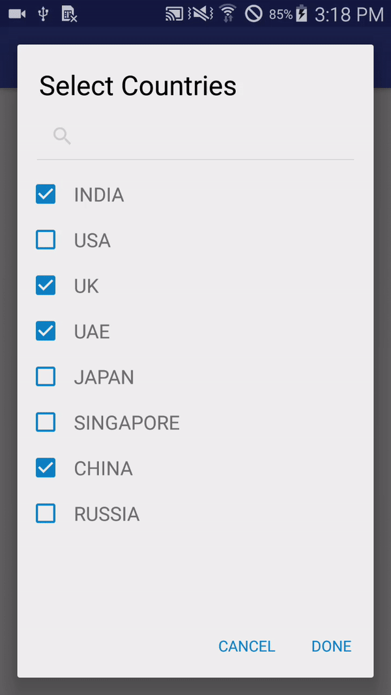

# MultiSelectDialog
A multi choice select dialog with Search and Text highlighting

Features
--------
* Provides Multi selection Dialog
* Search through list
* Highlighted the search text

Demo
--------
For a working implementation of this project see the `app/src/` folder.




Setup
--------


1. **Add the JitPack repository to your build file**

 Add it in your root build.gradle at the end of repositories:
```gradle
	allprojects {
		repositories {
			...
			maven { url 'https://jitpack.io' }
		}
	}
```

2. **Add the dependency**
```gradle
	dependencies {
       compile 'com.github.abumoallim:Android-Multi-Select-Dialog:v1.5'
	}
```

Usage
--------
See Sample in SampleApplication
```
 //MultiSelectModel
        MultiSelectDialog multiSelectDialog = new MultiSelectDialog()
                .title(getResources().getString(R.string.multi_select_dialog_title)) //setting title for dialog
                .titleSize(25)
                .positiveText("Done")
                .negativeText("Cancel")
                .preSelectIDsList(alreadySelectedCountries) //List of ids that you need to be selected
                .multiSelectList(listOfCountries) // the multi select model list with ids and name
                .onSubmit(new MultiSelectDialog.SubmitCallbackListener() {
                    @Override
                    public void onSelected(ArrayList<Integer> selectedIds, ArrayList<String> selectedNames, String dataString) {
                        //will return list of selected IDS
                        for (int i = 0; i < selectedIds.size(); i++) {
                            Toast.makeText(MainActivity.this, "Selected Ids : " + selectedIds.get(i) + "\n" +
                                    "Selected Names : " + selectedNames.get(i) + "\n" +
                                    "DataString : " + dataString, Toast.LENGTH_SHORT).show();
                        }


                    }

                    @Override
                    public void onCancel() {
                        Log.d(TAG,"Dialog cancelled");
                    }


                });

```


License
--------

    Copyright 2017 Abubakker Moallim

    Licensed under the Apache License, Version 2.0 (the "License");
    you may not use this file except in compliance with the License.
    You may obtain a copy of the License at

       http://www.apache.org/licenses/LICENSE-2.0

    Unless required by applicable law or agreed to in writing, software
    distributed under the License is distributed on an "AS IS" BASIS,
    WITHOUT WARRANTIES OR CONDITIONS OF ANY KIND, either express or implied.
    See the License for the specific language governing permissions and
    limitations under the License.
